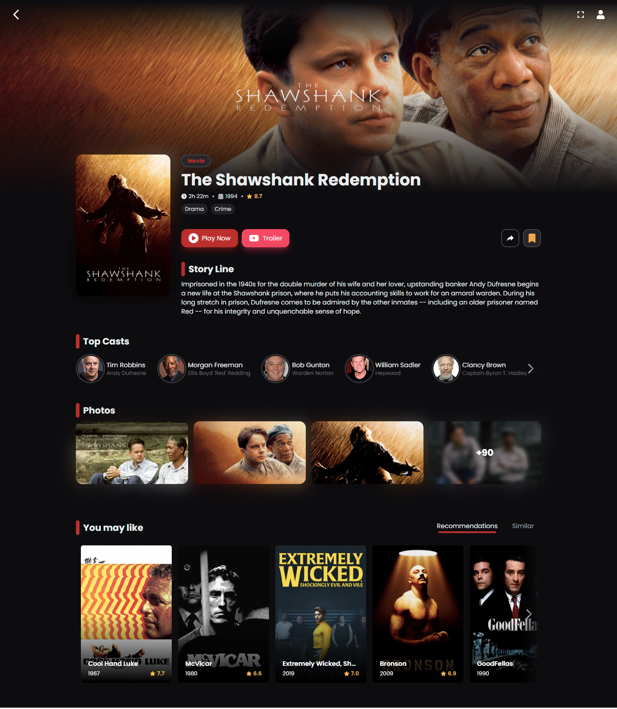
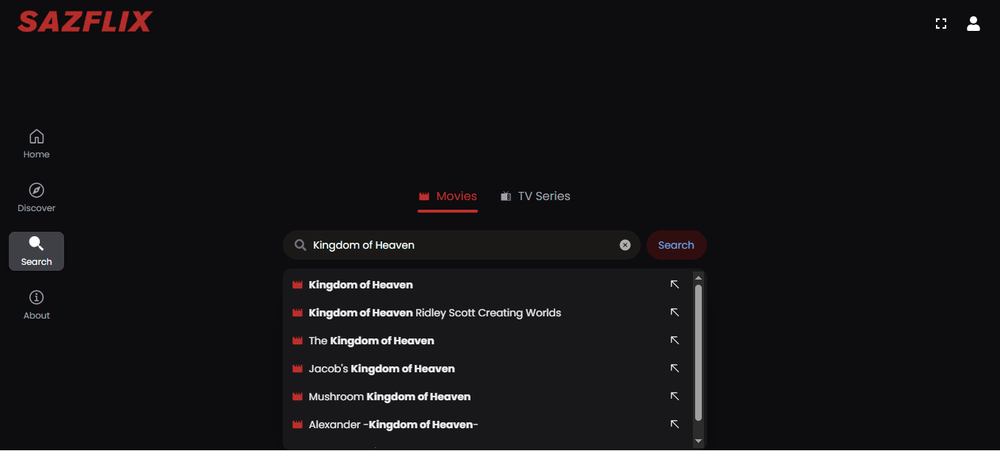

# Sazflix – Movie & TV Streaming Platform

A modern, full-featured movie and TV series streaming web application inspired by Netflix, built with a focus on performance, scalability, and premium user experience.

**Live Demo:** https://sazflix.vercel.app

---

## Overview

Sazflix is a fully functional streaming platform that allows users to browse, search, and stream movies and TV series through a clean, responsive, and modern interface.

This project was built to simulate a **real-world production streaming service**, focusing on:
- Scalable frontend architecture
- High-performance UI rendering
- PWA (Progressive Web App) capabilities
- Smooth and responsive user experience

---

## Key Features

### Streaming Experience
- Watch movies and TV series in a smooth, Netflix-style interface
- Dedicated detail pages for each title
- Responsive media layout for all screen sizes
- Seamless navigation between content

### Smart Discovery
- Search movies and TV shows instantly
- Browse trending and categorized content
- Fast and optimized API-driven content loading

### Progressive Web App (PWA)
- Installable on mobile and desktop devices
- App-like experience without browser UI
- Offline caching support (where applicable)
- Improved performance and load speed

### Performance & UX
- Optimized API calls for fast rendering
- Skeleton loading states for better UX
- Fully responsive design (mobile, tablet, desktop)
- Smooth transitions and modern UI interactions

---

## Tech Stack

### Frontend
- Next.js
- Tailwind CSS

### API / Data
- TMDB API (Movie & TV database) and custom backend integration

### Deployment
- Vercel

### PWA
- Service Workers
- Web App Manifest
- Caching strategies for offline experience

---

## Screenshots

### Home Page

### Movie Details ( I used the Movie The Shawshank Redemption )

### 🔍 Search Interface

---

## Project Status

✔ Fully Functional  
✔ Production-Level UI/UX  
✔ PWA Enabled  
✔ Actively Maintained & Improved  

---

## Source Code

The source code for this project is kept private as part of a personal portfolio and reusable project library.

This project is shared as a **live showcase application**.

For collaboration, freelance opportunities, or technical discussion, feel free to reach out.

---

## Contact

  

 

---

If you like this project feel free to connect or reach out.
